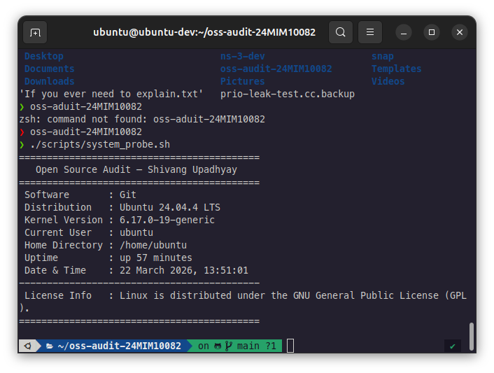
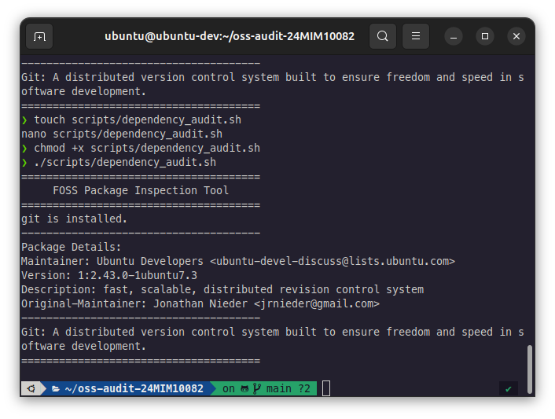
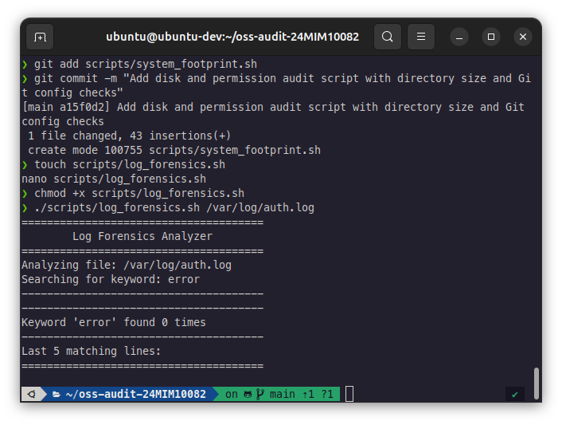
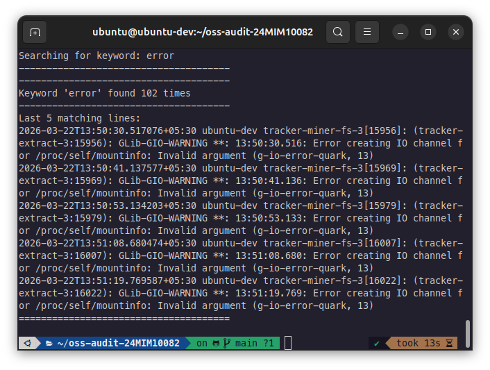
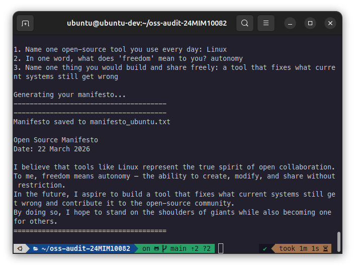

# Open Source Software Audit — Git

**Student Name:** Shivang Upadhyay  
**Registration Number:** 24MIM10082  
**Course:** Open Source Software  

---

# 1. Introduction

Open source software plays a major role in modern computing systems. Most of the tools that developers use today, whether it is operating systems, programming languages, or development tools, are built as open-source projects. Unlike proprietary software, open source allows users to access, modify, and distribute the source code. This makes it more flexible and encourages collaboration among developers across the world.

In many cases, people use open-source tools without fully understanding how they work or why they were created. However, every open-source project has a purpose, a history, and a set of ideas behind it. Understanding these aspects is important for anyone working in the field of software development.

In this project, Git has been chosen as the software to analyze. Git is one of the most widely used version control systems and is essential in modern development workflows. It is used by individuals as well as large organizations to manage and track changes in code.

This report explores Git from multiple perspectives, including its origin, licensing model, system-level behavior on Linux, and its role in the open-source ecosystem. In addition to theoretical analysis, the project also includes shell scripts that demonstrate practical interaction with the Linux system and Git environment.

---

# 2. Part A — Origin and Philosophy

## 2.1 Origin Story of Git

Git was created by Linus Torvalds in 2005 as a response to a real-world problem. Before Git existed, the Linux kernel project relied on a proprietary version control system called BitKeeper. While BitKeeper was free to use for the Linux community, its license was eventually revoked due to disagreements between the developers and the company maintaining it.

This created a serious issue for the Linux kernel development process, as there was no suitable alternative that met the project's needs. Linus Torvalds decided to build a new version control system that would be fast, distributed, and fully open source.

The initial version of Git was developed in a very short time, reportedly within a week. The goal was not to create a perfect system but to solve an urgent problem efficiently. Git introduced a distributed model, where every developer has a complete copy of the repository, making it faster and more reliable than centralized systems.

Over time, Git evolved into one of the most important tools in software development. It is now used by millions of developers worldwide and forms the foundation of platforms like GitHub and GitLab.

---

## 2.2 License Analysis (GPL v2)

Git is licensed under the GNU General Public License version 2 (GPL v2). This is a copyleft license, which means that any modifications to the software must also be released under the same license when distributed.

The GPL license is based on four main freedoms: the freedom to run the program for any purpose, the freedom to study how it works, the freedom to modify it, and the freedom to distribute copies. These freedoms ensure that the software remains open and accessible to everyone.

One important feature of GPL is that it prevents companies from taking the code, modifying it, and making it proprietary. If they distribute modified versions, they must also share the source code. This is often referred to as a “viral” license because it extends its requirements to derivative works.

Compared to more permissive licenses like MIT, GPL is stricter. While MIT allows almost unrestricted use, GPL focuses more on preserving openness. Personally, GPL seems more suitable for projects where maintaining openness is a priority.

---

## 2.3 Ethics of Open Source

Open source is not just about code; it is also about ideas and values. It promotes sharing knowledge, collaboration, and transparency. However, there are debates about whether all software should be open source.

On one hand, open source allows anyone to learn from existing projects and build on top of them. It encourages innovation and reduces duplication of effort. On the other hand, companies may rely heavily on open-source projects without contributing back, which raises ethical concerns.

For example, large companies use Linux and other open-source tools to build profitable products. While this is allowed by the license, it raises the question of whether they should contribute more to the community.

The idea of “standing on the shoulders of giants” is very relevant here. Open source enables developers to build on existing knowledge rather than starting from scratch. In my opinion, this accelerates innovation rather than limiting it.

---

# 3. Part B — Linux Footprint

## 3.1 Installation and Setup

Git can be easily installed on a Linux system using package managers such as apt. The installation process is simple and does not require manual compilation in most cases.

For example:

'''sudo apt install git'''

Once installed, Git can be verified using:

'git --version'

---

## 3.2 Directory Structure and Files

Git binaries are usually located in `/usr/bin/git`. Configuration files can be found in `/etc/gitconfig` (system-wide) and in the user’s home directory as `~/.gitconfig`.

Temporary and internal files are stored within `.git` directories inside repositories. These directories contain all version control data.

---

## 3.3 User and Permissions

Git runs as a normal user process and does not require root privileges for most operations. This is important for security, as it limits the potential impact of misuse.

File permissions follow standard Linux rules, and access is controlled based on user and group ownership.

---

## 3.4 Service and Update Mechanism

Git is not a background service; it is a command-line tool that runs when invoked. Updates are handled through the package manager, which allows users to receive security patches and improvements easily.

---

# 4. Part C — FOSS Ecosystem

## 4.1 Dependencies and Technical Stack

Git is primarily written in the C programming language. It relies on standard system libraries such as libc and interacts directly with the filesystem.

Its design focuses on performance and efficiency, which is why it is widely used for large projects.

---

## 4.2 Community and Governance

Git is maintained by a global community of developers, with Linus Torvalds still playing an important role. Contributions come from individuals as well as organizations.

Development is coordinated through mailing lists and repositories, reflecting the collaborative nature of open source.

---

## 4.3 Role in Modern Development

Git plays a central role in modern software development. It is used for version control, collaboration, and deployment workflows. Platforms like GitHub and GitLab are built around Git, making it essential for developers.

---

# 5. Part D — Open Source vs Proprietary

## 5.1 Comparison Table

| Feature | Git (Open Source) | SVN (Proprietary-style) |
|--------|------------------|------------------------|
| Cost | Free | May involve licensing |
| Model | Distributed | Centralized |
| Speed | Fast | Slower |
| Flexibility | High | Limited |
| Control | Community-driven | Organization-controlled |

---

## 5.2 Critical Analysis

Git offers greater flexibility and performance compared to centralized systems like SVN. Its distributed model allows developers to work offline and reduces dependency on a central server.

However, Git can be more complex for beginners, and its command set may be difficult to learn initially.

---

## 5.3 Final Verdict

Overall, Git is a powerful and efficient version control system that is well-suited for modern development environments. While it has a learning curve, its advantages outweigh its drawbacks.

---

# 6. Script Outputs

This section shows the output of the shell scripts developed as part of this project. Each script demonstrates a specific aspect of Linux system analysis and open-source interaction.

---

### Script 1 — System Identity Report

---

### Script 2 — Package Inspection (Dependency Audit)

---

### Script 3 — Disk and Permission Auditor

---

### Script 4 — Log File Analyzer

---

### Script 5 — Open Source Manifesto Generator

---

# 7. Conclusion

This project provided a deeper understanding of Git beyond its basic usage. It highlighted the importance of open-source philosophy, licensing, and system-level behavior.

Through both theoretical analysis and practical scripting, it became clear that open-source tools are not just software, but part of a larger ecosystem that drives innovation and collaboration.

---

# 8. References

- https://git-scm.com  
- https://www.gnu.org/licenses/gpl-2.0.html  
- https://opensource.org  
- Linux man pages  
